# Arquitectura de pagos y reservaciones

Estado: propuesta técnica posterior a Batch 4A. No constituye una implementación de Supabase, Mercado Pago, holds, webhooks ni F12.

## 1. Auditoría del estado actual

### Lo que existe

- `OnboardingState` conserva en memoria `name`, `emotion`, `therapyExperience`, `goals`, `appointment` y `contact`.
- `appointment` contiene únicamente `{ date, time }`; no tiene ID de slot, zona horaria, precio, moneda, expiración ni versión de servidor.
- F09 (`/onboarding/schedule`) consume `mockAvailability`: septiembre de 2026, fecha `2026-09-16` y horarios `10:00`, `12:30`, `18:00`.
- F09 navega a `/onboarding/checkout` si existen fecha y hora.
- Checkout comparte una sola ruta y alterna localmente entre `details` y `payment`.
- Los datos de contacto están en Context; los campos visuales de tarjeta viven localmente en `PaymentSection`.
- `PaymentProvider` es una frontera mínima sin implementación: `createPayment(): Promise<PaymentResult>`.
- No existen Route Handlers, servidor de booking, base de datos, Supabase, SDK de Mercado Pago, webhook, hold ni confirmación definitiva.

### Qué puede conservarse

- La composición visual de F09, F10 y F11.
- Los componentes `ContactDetails`, `ConsentField` y `AppointmentSummary`, cambiando sus datos de entrada por DTOs confirmados por servidor.
- La transición visual `details → payment`, siempre que el paso a `payment` ocurra después de crear un hold real.
- El Context para respuestas transitorias del onboarding. Las respuestas personales no deben copiarse a la base por defecto.
- La regla de que PAN, CVV, vencimiento y datos equivalentes de tarjeta no entren al Context ni a nuestra base.
- `PaymentResult` como concepto, ampliándolo para representar una operación asíncrona y verificable.

### Fronteras nuevas necesarias

1. `AvailabilityService`: consulta slots reales desde servidor.
2. `BookingService`: crea hold, devuelve su vencimiento y permite consultar el booking.
3. `PaymentService` server-side: crea el intento de pago para un booking válido.
4. `PaymentProviderAdapter`: único módulo conocedor de Mercado Pago.
5. `WebhookProcessor`: valida firma, obtiene el pago desde Mercado Pago y aplica cambios idempotentes.
6. `BookingRepository` / funciones transaccionales en Postgres: autoridad sobre concurrencia y estados.
7. `BookingStatusDTO`: estado seguro que el cliente puede consultar sin recibir secretos ni datos innecesarios.
8. Un proceso de expiración/reconciliación para holds vencidos y pagos tardíos.

La interfaz actual `PaymentProvider.createPayment()` no es suficiente: no recibe booking, monto, moneda ni clave idempotente, y su resultado podría interpretarse incorrectamente como autoridad del navegador. La frontera futura debe vivir en servidor.

## 2. Flujo end-to-end recomendado

1. El cliente solicita disponibilidad para un rango y zona horaria.
2. El servidor devuelve slots con IDs opacos, hora de inicio/fin y disponibilidad; el cliente no construye un slot enviando solo fecha/hora.
3. Al continuar desde F09, el cliente pide crear un hold para un `slotId`.
4. Una transacción Postgres bloquea el slot, descarta/expira cualquier hold vencido y crea exactamente un appointment `held` con `hold_expires_at ≈ now() + 5 minutos`.
5. El servidor devuelve `bookingId`, `holdExpiresAt`, resumen y un token de acceso limitado al booking o lo vincula a una sesión autenticada.
6. El cliente captura contacto. El servidor vuelve a validar email, teléfono, consentimiento, booking y vigencia del hold.
7. Al abrir F11, el servidor cambia `held → payment_pending` y crea/reutiliza un registro `payments` con una clave idempotente estable.
8. El componente oficial de Mercado Pago tokeniza los datos de tarjeta directamente para el proveedor. PAN/CVV no pasan por nuestros logs ni se persisten.
9. Un Route Handler server-side crea el pago usando monto y moneda leídos de la base, nunca del cliente.
10. La respuesta inmediata alimenta UX de procesamiento, pendiente o rechazo, pero no basta para confirmar la cita.
11. Mercado Pago envía webhook. El servidor valida `x-signature`, obtiene el recurso de pago desde la API del proveedor y compara `external_reference`, monto, moneda y cuenta receptora.
12. En una transacción idempotente se actualiza `payments.status`; si el pago verificado está aprobado y el slot todavía corresponde al booking, se confirma el appointment.
13. Notificaciones, Meet y Calendar se ejecutarían después como trabajos idempotentes; no forman parte de la transacción de confirmación.
14. El cliente consulta el estado por `bookingId` al regresar, refrescar o reabrir. F12 solo aparece cuando el servidor responde `appointment.status = confirmed`.

## 3. Máquina de estados

### Modelo conceptual solicitado

```mermaid
stateDiagram-v2
  [*] --> available
  available --> held: hold transaccional
  held --> payment_pending: inicia intento de pago
  held --> expired: vence sin pago
  held --> cancelled: cancelación explícita
  payment_pending --> payment_pending: proveedor pendiente / reintento idempotente
  payment_pending --> held: pago rechazado y hold aún vigente
  payment_pending --> expired: hold vence sin aprobación
  payment_pending --> paid: webhook verifica approved
  paid --> confirmed: confirma booking
  confirmed --> cancelled: cancelación operativa posterior
  expired --> paid: pago tardío; requiere conciliación
```



### ¿`paid` y `confirmed` deben ser independientes?

Sí como hechos de dominio, pero no necesariamente como dos estados persistentes consecutivos de `appointments`.

- `paid` pertenece naturalmente a `payments.status = approved`.
- `confirmed` pertenece a `appointments.status = confirmed`.
- En el caso normal, el webhook debe actualizar el pago a `approved` y el appointment a `confirmed` dentro de una sola transacción. Así se evita dejar una cita pagada pero sin confirmar por un fallo entre escrituras.
- Aun así, la distinción conceptual es imprescindible para pagos tardíos, montos incorrectos, fraude, contracargos o fallos de conciliación. En esos casos el pago puede estar aprobado mientras el appointment permanece `expired` o `cancelled` y requiere resolución/reembolso.

Por tanto, no se recomienda guardar `appointments.status = paid` como estado normal duradero. Si se incluye por trazabilidad, debe ser transitorio dentro de la misma transacción. La fuente de verdad de “pagado” es la tabla `payments`; la de “cita confirmada” es `appointments`.

### Transiciones que deben ocurrir exclusivamente en servidor

- `available → held`.
- Cualquier transición que ocupe o libere un slot.
- `held → payment_pending`.
- Cualquier actualización basada en una respuesta de Mercado Pago.
- `payment_pending → confirmed` tras verificación del pago.
- `held/payment_pending → expired`.
- Cualquier transición a `cancelled` que tenga efecto operativo.

El cliente solo solicita una transición y presenta el estado devuelto; nunca asigna `paid`, `confirmed`, `expired` o `cancelled`.

## 4. Esquema Supabase/Postgres propuesto

Se recomienda una entidad separada `slots`. Sin ella, la disponibilidad tendría que inferirse de reglas externas y appointments; eso complica bloqueos, horarios bloqueados manualmente, cambios de agenda y consultas eficientes. `available` se interpreta como un slot abierto sin appointment activo, no como una fila de appointment vacía.

Los nombres y tipos siguientes son propuesta, no SQL ejecutado.

### `slots`

| Columna | Tipo | Reglas |
|---|---|---|
| `id` | `uuid` | PK, generado en servidor |
| `starts_at` | `timestamptz` | requerido |
| `ends_at` | `timestamptz` | requerido; `ends_at > starts_at` |
| `timezone` | `text` | requerido; IANA, por ejemplo `America/Mexico_City` |
| `availability_status` | enum/text | `open`, `blocked`, `cancelled` |
| `created_at` | `timestamptz` | default `now()` |
| `updated_at` | `timestamptz` | mantenido por servidor |

Índices y constraints:

- PK en `id`.
- `unique(starts_at, ends_at)` si solo existe una terapeuta/recurso; si se generaliza, `unique(resource_id, starts_at)`.
- Índice `(availability_status, starts_at)` para consultas de agenda.
- Check de duración esperada, por ejemplo 50 minutos, si la regla es invariable.

### `appointments`

| Columna | Tipo | Reglas |
|---|---|---|
| `id` | `uuid` | PK; referencia interna de booking |
| `slot_id` | `uuid` | FK a `slots(id)`, requerido |
| `status` | enum/text | `held`, `payment_pending`, `confirmed`, `expired`, `cancelled` |
| `hold_expires_at` | `timestamptz` | requerido para `held/payment_pending`; nulo tras confirmar/cancelar |
| `email` | `citext` o `text` | requerido antes de iniciar pago; normalizado |
| `country_code` | `text` | requerido antes de iniciar pago |
| `phone` | `text` | requerido antes de iniciar pago; formato normalizado, idealmente E.164 |
| `consent_version` | `text` | versión del aviso aceptado |
| `consented_at` | `timestamptz` | timestamp server-side |
| `amount_minor` | `integer` | requerido; `80000` para MXN $800.00 |
| `currency` | `char(3)` | requerido; `MXN` |
| `confirmed_at` | `timestamptz` | nulo hasta confirmar |
| `cancelled_at` | `timestamptz` | opcional |
| `created_at` | `timestamptz` | default `now()` |
| `updated_at` | `timestamptz` | mantenido por servidor |

Índices y constraints:

- FK `slot_id → slots.id` con borrado restringido.
- Índice `(slot_id, status)` y `(status, hold_expires_at)`.
- Índice único parcial sobre `slot_id` para estados que ocupan el slot: `held`, `payment_pending`, `confirmed`. Este constraint es la última defensa contra doble booking.
- Checks: monto positivo; moneda en allowlist; consentimiento coherente; expiración presente solo en estados temporales.
- No guardar `name`, `emotion`, `therapyExperience` ni `goals` salvo que exista una finalidad clínica explícita, consentimiento específico y política de retención aprobada.

### `payments`

| Columna | Tipo | Reglas |
|---|---|---|
| `id` | `uuid` | PK interna |
| `appointment_id` | `uuid` | FK a `appointments(id)`, requerido |
| `provider` | `text` | `mercado_pago` |
| `attempt_no` | `smallint` | requerido; comienza en 1 |
| `idempotency_key` | `uuid/text` | única, generada por servidor |
| `external_reference` | `text` | única; valor opaco asociado al appointment/intento |
| `provider_payment_id` | `text` | único cuando exista |
| `status` | enum/text | `created`, `processing`, `pending`, `approved`, `rejected`, `cancelled`, `refunded`, `charged_back` |
| `status_detail` | `text` | opcional, sanitizado |
| `amount_minor` | `integer` | copia inmutable para conciliación |
| `currency` | `char(3)` | copia inmutable |
| `provider_updated_at` | `timestamptz` | para ordenar cambios del proveedor |
| `approved_at` | `timestamptz` | opcional |
| `created_at` | `timestamptz` | default `now()` |
| `updated_at` | `timestamptz` | mantenido por servidor |

Índices y constraints:

- `unique(idempotency_key)`.
- `unique(external_reference)`.
- `unique(provider, provider_payment_id)` cuando el ID exista.
- `unique(appointment_id, attempt_no)`.
- Índices `(appointment_id, created_at desc)` y `(status, updated_at)`.
- Checks de monto/moneda y `attempt_no > 0`.
- No guardar PAN, CVV, vencimiento, token de tarjeta reutilizable ni payloads que contengan esos datos.

### `payment_webhook_events`

Aunque el mínimo de negocio son `appointments` y `payments`, esta tabla pequeña es recomendable para idempotencia y observabilidad.

| Columna | Tipo | Reglas |
|---|---|---|
| `id` | `bigint generated always as identity` | PK |
| `provider` | `text` | requerido |
| `event_key` | `text` | único; combinación estable del evento/recurso |
| `provider_payment_id` | `text` | indexado |
| `action` | `text` | opcional |
| `provider_created_at` | `timestamptz` | opcional |
| `received_at` | `timestamptz` | default `now()` |
| `processed_at` | `timestamptz` | opcional |
| `processing_status` | enum/text | `received`, `processed`, `ignored`, `failed` |
| `failure_code` | `text` | opcional, sin secretos |

No es necesario conservar indefinidamente el payload completo. Si se conserva temporalmente para soporte, debe estar cifrado/restringido, redactado y sujeto a retención corta.

### Acceso y RLS

- Las tablas no deben ser escribibles directamente por el navegador.
- Preferir un schema privado para funciones/tablas operativas, o RLS sin políticas públicas y acceso solo desde Route Handlers con credenciales server-side.
- Nunca exponer `service_role` o secret keys mediante variables `NEXT_PUBLIC_*`.
- Si se crean funciones privilegiadas, mantenerlas fuera de schemas expuestos, fijar `search_path`, revocar `EXECUTE` a `PUBLIC` y conceder solo a roles necesarios.

## 5. Estrategia de hold

### Recuperación segura (Batch 4B-3)

- El servidor genera 32 bytes aleatorios y entrega el secreto únicamente como cookie `miriam_booking_session` HttpOnly, `SameSite=Lax`, `Path=/` y `Secure` en producción.
- Postgres conserva sólo el SHA-256 hexadecimal del secreto en `appointments.booking_access_token_hash`, protegido por formato e índice único. El secreto raw no se registra, no aparece en JSON y no llega a Client Components ni a Web Storage.
- La adquisición y el replay idempotente rotan el hash dentro de la misma transacción que valida el hold. Un replay conserva el mismo appointment y devuelve una cookie nueva, sin necesitar recuperar un secreto raw previo de la base.
- `/api/bookings/current` autoriza exclusivamente mediante cookie/hash. Conocer `appointmentId` no concede lectura ni escritura.
- `/api/bookings/contact` valida Origin contra el host de la petición como defensa CSRF adicional a `SameSite=Lax`, normaliza email/teléfono y persiste sólo contacto y consentimiento `booking-v1` con hora del servidor.
- Un hold vencido nunca se reactiva. Al detectarlo autoritativamente, el servidor lo marca `expired`, elimina su hash y expira la cookie; lo mismo ocurre para bookings cancelados o credenciales inválidas.

### Creación

- Se crea al pulsar Continuar en F09, antes de mostrar el estado payment.
- Entrada: `slotId` y una clave idempotente de operación; no fecha/hora libres.
- Dentro de una transacción: bloquear la fila del slot con `SELECT ... FOR UPDATE`, comprobar que está abierta, expirar un hold previo si `hold_expires_at <= now()`, crear el appointment y devolverlo.
- El índice único parcial sobre appointments activos protege incluso si dos solicitudes atraviesan verificaciones simultáneas.

### Duración y reloj

- `hold_expires_at` se calcula en Postgres/servidor, nunca con el reloj del navegador.
- Aproximadamente cinco minutos. El contador del cliente es informativo; al llegar a cero debe volver a consultar al servidor.
- La disponibilidad considera libre un hold vencido, aunque el job de limpieza todavía no haya actualizado su estado. La siguiente creación de hold debe expirar el anterior transaccionalmente.

### Renovación

- Recomendación inicial: no renovar automáticamente. Evita acaparamiento y simplifica abuso/concurrencia.
- Si UX exige renovación, permitir como máximo una extensión corta, server-side, antes de iniciar el pago, con rate limit y solo si el mismo booking sigue ocupando el slot.
- Una vez enviado el pago, puede existir una pequeña gracia server-side definida explícitamente, no una extensión ilimitada desde el cliente.

### Expiración y liberación

- Un job periódico marca `held/payment_pending` vencidos como `expired` cuando no existe pago aprobado.
- La liberación es consecuencia de salir de los estados incluidos en el índice único parcial.
- El job mejora limpieza y observabilidad; la corrección no depende exclusivamente de que corra a tiempo.

### Pago posterior a la expiración

- Nunca reasignar automáticamente el slot si ya fue ocupado por otro booking.
- Registrar el pago verificado como `approved`.
- Si el slot sigue libre y la política lo permite, una transacción puede confirmar el booking tardío.
- Si ya no está libre, mantener appointment `expired`, marcar el pago para conciliación/reembolso y no mostrar F12. Generar alerta operativa y ejecutar un reembolso idempotente en un batch posterior.

## 6. Arquitectura de Mercado Pago

### Frontera futura

La abstracción debe estar separada entre contrato de aplicación y adaptador del proveedor:

```ts
type CreatePaymentCommand = {
  appointmentId: string;
  paymentAttemptId: string;
  token: string;
  payerEmail: string;
};

type ProviderPaymentSnapshot = {
  providerPaymentId: string;
  status: "processing" | "pending" | "approved" | "rejected" | "cancelled";
  statusDetail?: string;
  externalReference: string;
  amountMinor: number;
  currency: "MXN";
  providerUpdatedAt: string;
};

interface PaymentProvider {
  createPayment(command: CreatePaymentCommand, idempotencyKey: string): Promise<ProviderPaymentSnapshot>;
  getPayment(providerPaymentId: string): Promise<ProviderPaymentSnapshot>;
}
```

El `token` sería efímero y producido por el Brick/SDK oficial. No se persiste ni se registra. El adaptador obtiene monto, moneda y `external_reference` del intento guardado; nunca acepta esos valores como autoridad del navegador.

### Referencias e idempotencia

- `appointment.id`: referencia interna estable del booking.
- `payments.id`: referencia interna del intento.
- `external_reference`: valor opaco único que identifica el intento o booking; no incluir email/teléfono.
- `provider_payment_id`: ID devuelto por Mercado Pago y recuperado en webhook.
- `idempotency_key`: estable por intento de creación. Reintentar la misma operación reutiliza la misma clave; un intento realmente nuevo obtiene otra.
- Mercado Pago exige `X-Idempotency-Key` en APIs de pagos/reembolsos; la clave debe generarse y persistirse antes de llamar al proveedor.

### Respuesta inmediata

- `approved`: mostrar procesamiento mientras se espera/verifica servidor o consultar el booking; no confirmar desde la respuesta del browser.
- `pending`: conservar appointment en `payment_pending` dentro de la política temporal y mostrar E06.
- `rejected`: registrar el intento rechazado; si el hold sigue vigente volver a `held` para permitir otro intento, sin crear otro appointment.
- Timeout/red desconocida: no crear un segundo pago con otra clave. Consultar/reintentar con la misma idempotency key.

## 7. Webhook e idempotencia

### Algoritmo

1. Recibir `POST` en un Route Handler dedicado.
2. Limitar tamaño y tipo del body; extraer IDs sin confiar en campos de estado del payload.
3. Validar la firma `x-signature` y request ID conforme a la documentación vigente de Mercado Pago.
4. Insertar `payment_webhook_events.event_key` con constraint único. Si ya existe, responder 200 sin repetir efectos.
5. Obtener el pago por `provider_payment_id` desde Mercado Pago usando credenciales server-side.
6. Localizar `payments` por `(provider, provider_payment_id)` o `external_reference` y validar appointment, monto, moneda y ambiente.
7. Dentro de una transacción y con bloqueo de payment/appointment:
   - Ignorar snapshots más antiguos que `provider_updated_at`.
   - Aplicar solo transiciones monotónicas válidas.
   - Actualizar `payments.status` desde el snapshot verificado.
   - Si está aprobado, confirmar el appointment únicamente si conserva el derecho al slot; resolver el caso tardío según la política anterior.
   - Marcar el evento procesado.
8. Responder 200/201 rápidamente. Los efectos secundarios se encolan o se ejecutan después de confirmar la transacción.

Mercado Pago documenta que los webhooks pueden reintentarse si no reciben 200/201 y recomienda recuperar el recurso notificado desde su API. La duplicación es comportamiento esperado, no una excepción.

### Eventos duplicados y fuera de orden

- Duplicados: `event_key` único más operaciones idempotentes.
- Fuera de orden: comparar `provider_updated_at` y una tabla explícita de transiciones; nunca degradar `approved` a `pending` por un evento anterior.
- Refresh: el cliente consulta `/api/bookings/:id`; no repite la creación de pago.
- Abandono después de pagar: el webhook confirma sin depender de que el browser regrese.

### Fuentes de verdad

- `payment.status`: snapshot más reciente obtenido server-to-server de Mercado Pago y persistido en `payments`.
- `appointment.status`: Postgres, modificado únicamente por funciones/servicios server-side que aplican las invariantes de slot y pago.
- La URL de retorno, el estado React y el payload no verificado del webhook no son fuentes de verdad.

## 8. Responsabilidades por capa

### React cliente

- Presentar disponibilidad devuelta por servidor.
- Solicitar hold y mostrar `holdExpiresAt`.
- Capturar contacto y consentimiento.
- Montar el Brick/SDK oficial y obtener un token efímero.
- Mostrar estados y consultar el booking.
- No calcular precio final, confirmar citas ni conservar secretos/PAN/CVV.

### Next.js server

- Validar todos los inputs y autorización del booking.
- Leer precio, moneda y slot desde base.
- Orquestar hold, creación/consulta de pago y proyección segura del estado.
- Guardar secretos solo en variables server-side.
- Aplicar rate limiting, protección CSRF/origin cuando corresponda y redacción de logs.

### Route Handlers propuestos

- `GET /api/availability?from=&to=`: slots disponibles.
- `POST /api/bookings/hold`: hold idempotente.
- `GET /api/bookings/[id]`: resumen y estado seguro.
- `POST /api/bookings/[id]/contact`: valida/guarda contacto y consentimiento.
- `POST /api/bookings/[id]/payments`: crea o recupera intento idempotente.
- `POST /api/webhooks/mercado-pago`: webhook firmado e idempotente.

Los paths son propuestas. No deben exponer acceso arbitrario por UUID: usar sesión autenticada o un secreto de booking de alta entropía almacenado como hash, con expiración y scope limitado.

### Supabase/Postgres

- Persistencia y constraints.
- Locks y transacciones de hold/confirmación.
- Unicidad del slot activo.
- Cron de expiración/reconciliación.
- RLS/privilegios como defensa en profundidad.

## 9. Mapeo a estados visuales futuros

| Pantalla | Estado backend que la alimenta | Regla |
|---|---|---|
| E02 Pago procesando | payment `created/processing` y appointment `payment_pending` | Operación enviada o resultado todavía no verificado |
| E03 Pago rechazado | payment `rejected` | Mostrar razón segura; permitir reintento solo si hold sigue vigente |
| E04 retorno exitoso | retorno del proveedor + consulta server-side | Es una pantalla de espera/verificación, no confirmación por parámetros URL |
| E06 pago pendiente | payment `pending` | Appointment sigue `payment_pending`; consultar posteriormente |
| F12 pago recibido | payment `approved` y appointment `confirmed` | Única condición para presentar confirmación definitiva |

Si el pago está `approved` pero el appointment no pudo confirmarse, ninguna de estas pantallas debe afirmar que la cita quedó reservada; mostrar estado de conciliación y soporte.

## 10. Errores y recuperación

- Slot ocupado al crear hold: `409 SLOT_UNAVAILABLE`; volver a F09 con disponibilidad refrescada.
- Hold vencido antes de pagar: `409 HOLD_EXPIRED`; desactivar checkout y ofrecer elegir otro horario.
- Request duplicado: devolver el recurso creado anteriormente usando la clave idempotente.
- Timeout al crear pago: estado indeterminado; consultar por intento/idempotency key antes de reintentar.
- Pago rechazado: conservar booking mientras el hold sea válido; crear un nuevo `payments.attempt_no` solo por acción explícita.
- Pago pendiente: no liberar inmediatamente; aplicar una política documentada de gracia/reconciliación y consultar al proveedor.
- Webhook inválido: 401/400, sin mutaciones ni detalles sensibles en logs.
- Webhook de pago desconocido: registrar metadatos mínimos y alertar; no crear bookings desde el webhook.
- Pago aprobado con monto/moneda incorrectos: no confirmar; marcar conciliación.
- Pago tardío con slot reasignado: no confirmar; reembolso/operación manual idempotente.
- Fallo de notificación/Meet/Calendar: la cita permanece confirmada; reintentar el efecto secundario sin repetir el pago.

## 11. Seguridad y minimización de datos

### Datos que sí pueden almacenarse

- Email, teléfono normalizado, country code.
- Versión del consentimiento y timestamp server-side.
- Slot, timestamps, estado y precio de la cita.
- IDs/referencias del proveedor, estado del pago, monto, moneda y timestamps necesarios para conciliación.

### Datos que no deben almacenarse

- PAN completo, CVV, vencimiento, datos de banda/chip o credenciales del usuario.
- Token efímero de tarjeta más tiempo del necesario.
- Respuestas personales del cuestionario por conveniencia técnica.
- Payloads completos del proveedor sin una necesidad y retención justificadas.

### Información que debe evitar logs

- Email/teléfono completos, tokens, PAN/CVV, headers de autorización, firmas y secretos.
- Bodies de creación de pago y webhook sin redacción.
- Respuestas clínicas o texto libre futuro.

Usar IDs internos, códigos de error y últimos cuatro dígitos únicamente si el proveedor los entrega y existe una finalidad operacional aprobada.

### Validación server-side obligatoria

- Slot existente, abierto y no ocupado.
- Hold perteneciente al solicitante y no vencido.
- Email/teléfono/consentimiento.
- Precio y moneda desde configuración/base.
- Allowlist de estados y transiciones.
- Firma del webhook y consulta server-to-server del recurso.
- Correspondencia de `external_reference`, payment ID, monto y moneda.
- Rate limits e idempotency keys.

## 12. Plan recomendado por batches

### Batch 4B-1 · Persistencia y disponibilidad

- Crear migraciones para `slots`, `appointments` y constraints.
- Configurar RLS/privilegios sin acceso directo de escritura desde cliente.
- Implementar disponibilidad de solo lectura y fixtures de prueba.
- Sustituir `mockAvailability` mediante una interfaz, manteniendo fallback únicamente en desarrollo explícito.

### Batch 4B-2 · Hold transaccional

- Implementar función/transacción de hold y endpoint idempotente.
- Añadir expiración y job de limpieza.
- Conectar F09 y el contador visual a `holdExpiresAt`.
- Pruebas de concurrencia: dos clientes, un slot, un único ganador.

### Batch 4B-3 · Contacto y recuperación de checkout

- Persistir solo contacto/consentimiento necesarios.
- Añadir acceso seguro por sesión o booking token.
- Restaurar checkout tras refresh sin persistir respuestas del cuestionario.

### Batch 4B-4 · Mercado Pago sandbox

- Integrar Brick/SDK oficial y adaptador server-side.
- Crear intentos e idempotency keys antes de la llamada.
- Implementar E02/E03/E06 sin F12 todavía.
- Verificar que PAN/CVV nunca atraviesen nuestros servidores o logs.

### Batch 4B-5 · Webhook y confirmación

- Validar firma, consultar pago y procesar eventos idempotentemente.
- Confirmar appointment en transacción.
- Implementar reconciliación de pagos tardíos y reembolsos como flujo separado.
- Habilitar F12 solo con `payment=approved` y `appointment=confirmed` verificados.

### Batch 4B-6 · Efectos posteriores y hardening

- Jobs idempotentes para email, WhatsApp, Calendar y Meet.
- Observabilidad redactada, alertas y runbooks.
- Pruebas de caos: duplicados, out-of-order, timeout, refresh, abandono, hold vencido y webhook tardío.

## 13. Referencias oficiales consultadas

- [Mercado Pago: Webhooks y validación de firma](https://www.mercadopago.com.mx/developers/es/docs/your-integrations/notifications/webhooks)
- [Mercado Pago: uso obligatorio de X-Idempotency-Key](https://www.mercadopago.com.mx/developers/es/news/2023/01/04/Idempotency-key-usage-will-be-mandatory)
- [Supabase: Database Functions](https://supabase.com/docs/guides/database/functions)
- [Supabase: Cron](https://supabase.com/docs/guides/cron)
- [Supabase: seguridad del Data API](https://supabase.com/docs/guides/api/securing-your-api)
- [Supabase: connection management](https://supabase.com/docs/guides/database/connection-management)
